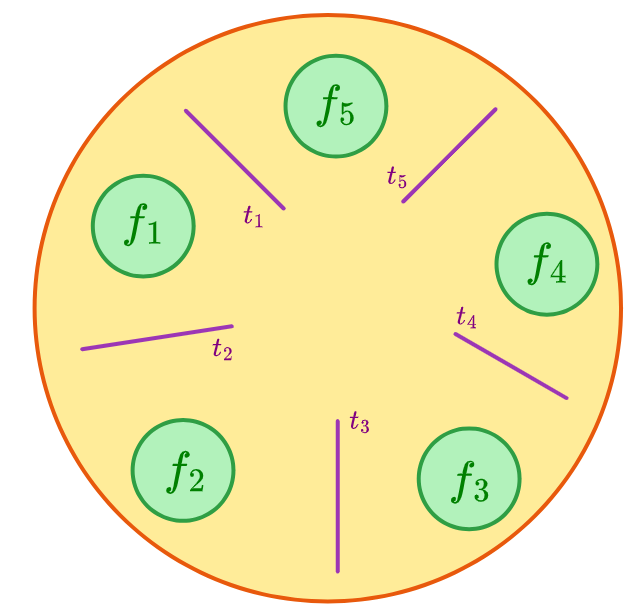

# Laboratorio 2: Sincronización de procesos: El problema de los filósofos
Este cuarto laboratorio se centra los métodos de sincronización de procesos, en particular el uso de semáforos para resolver "*el problema de los filósofos*".

Se busca comprender el funcionamiento de los semáforos en el lenguaje C para sincronizar procesos entre sí; todo ello mediante el uso de las bibliotecas `pthread.h` y `semaphore.h`.

## El problema de los filósofos:
Cinco filósofos se sientan en una mesa redonda. Cada uno cuenta con un plato de espagueti y un tenedor a su lado. El espagueti es tan escurridizo que un filósofo necesita de DOS tenedores para comerlo. Entre cada dos platos existe un tenedor, por lo que existe un número de filósofos igual al de tenedores. Cada filósofo cuenta con dos períodos de tiempo: uno en el que come y otro en el que piensa. Al sentir hambre, cada filósofo intenta tomar los cubiertos a sus lados, lo intenta con la izquierda y lo intenta con la derecha, toma un bocado del espagueti y lo come. Al terminar, deja los tenedores en su lugar y vuelve a pensar.

  

## Tareas del presente laboratorios
- Se solicita crear implementar un programa en C que resuelva el problema de los filósofos mediante el uso de semáforos.

## Ejecución del programa
Luego de ejecutar `make folders` y `make` se pueden ejecutar dos programas: `philosopher.out` y `philosopher2.out`presentes en la carpeta `build/`. Ambos programas ejecutarían el problema de los filósofos, el primero imprimiendo por la terminal el cambio de estado de cada filósofo mientras el segundo imprimiría el estado de todos los filósofos al mismo tiempo en cada cambio de estado.

## Informe del laboratorio
El informe de laboratorio se encuentra en el archivo [Indorme.pdf](/laboratorio4/docs/Informe_lab.pdf).

(El presente laboratorio fue realizado en conjunto con [Ayrton Morrison](https://github.com/ayrtonmo)).